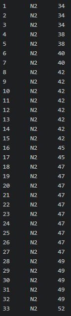

# Data Organizer
This project is separated in 4 main modules working in 2 different steps. Original data must be UTF8 and program specifics compliant.

## High level project overview
### Step 1 Modules
- Replacer.py
- Parser.py
- Namer.py
### Step 2 Module
- Ratio.py

Or you can run all at once by running the Main.py

### File Structure
Original files where nothing has been processed yet is to be placed in a folder named *original_record*. Once step 1 modules finishes running, it well create files where each strand within the record.txt is separated into different .txt files. This result file structure will be outputted to a folder called *separated_records*. Once the separated records are ready, FreqFraq.py can be run. FreqFraq.py will produce survival and mortality frequency/fraction data for each strands. These files will be located within the freqfraq folder.
## Module details
### Replacer.py
Replaces specific non-utf8 compliant characters to compliant string.
```kotlin
// Specific replacement
for line in fileinput.input([file], inplace=True):
    print(line.replace('°C', 'dgr'), end='')
    print(line.replace('∞C', 'dgr'), end='')
```

### Parser.py
Separates one file contains multiple different strands into separate strand file under a correct folder structure.
### Namer.py
Names each produced files with its appropriate strand name.
### Ratio.py
Creates survival and mortality frequency/fraction data for each strands.
### Main.py
Runs all modules in sequence.

## IO Structure
This program will take in a record of unsplitted mortality data for variouse strains and produce:
1. Strain specific mortality data
2. Strain specific mortality frequency/fraction and survival frequency/fraction

### Original Data
Original data is to be located within the [original_records](https://gitlab.com/ya.atajan/BDLab-data-organizer/tree/master/original_records) folder. The folder will contain original file which should follow this formatting.


### Splitted Data
Splitted data from the step 1 module will be located in the [separated_records](https://gitlab.com/ya.atajan/BDLab-data-organizer/tree/master/separated_records) folder. Each strain is separated into their respective temprature environment and to respective categories as below:

They are then further devided into specific strands:

The files are in the same formatting as original, where each column is ordered as [count], [strain name], [age at  death].


### FreqFraq data
Frequency and fraction data from step2 module is located below [freqfrq](https://gitlab.com/ya.atajan/BDLab-data-organizer/tree/master/freqfrq) folder. The folder structure then follows the order of "strain category -> strain name -> frequency/fraction type -> file".
For example, following file path will lead to the mortality frequency file for the strain N2 under * 15 degrees-A\_E19\_112709_15(G1)r category:


Frequency data shows frequency of either mortality or survival (still alive) at given date for the specific strand. For N2 i mentioned above, mortality frequency looks something like this:


And survival frequency:


Fraction data displays the fraction of strains that are still alive or have died. They are formatted similarly to the frequency data and are as follows:

Moratality:


Survivial:

